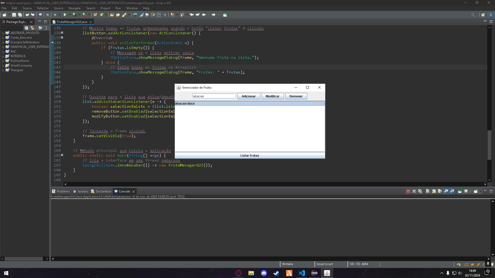

# Lista de Exercícios - GERENCIAMENTO FRUTAS (GRAPHICAL USER INTERFACE)

Projeto da matéria de POO FACENS

## 🚀 Começando

* CRIE UM PROJETO JAVA PARA MESCLAR OS CONHECIMENTOS SOBRE O USO DE ARRAY E DE INTERFACES;
* PARA ISSO CONSTRUA UM CÓDIGO QUE TENHA UM INTERFACE E QUE REALIZE AS OPERAÇÕES ENCONTRADAS NO PROJETO DE GERENCIAMENTO DE FRUTAS;

## 🛠️ Construído com

* EclipseIDE

## 📌 Versão

* **Versão 1.0** 

## ✒️ Autores

* **Gabriel Alesiunas** - *GERENCIAMENTO FRUTAS (GRAPHICAL USER INTERFACE)* 
